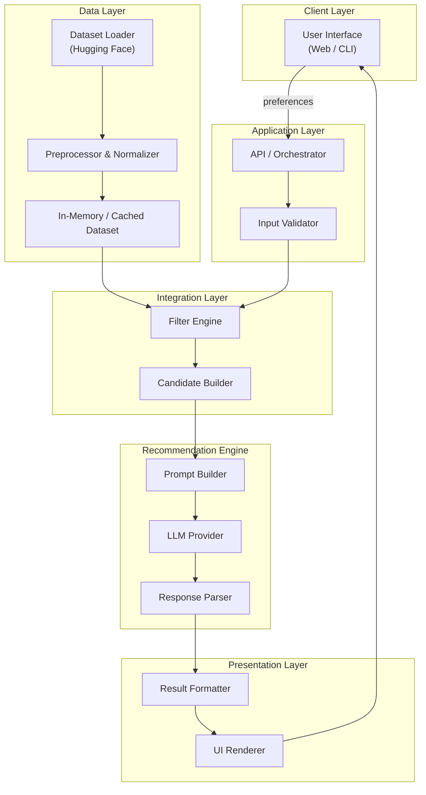
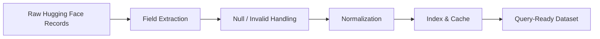
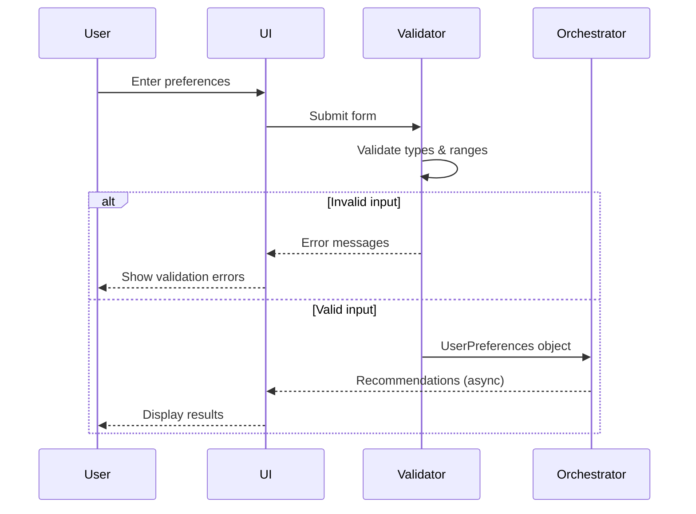
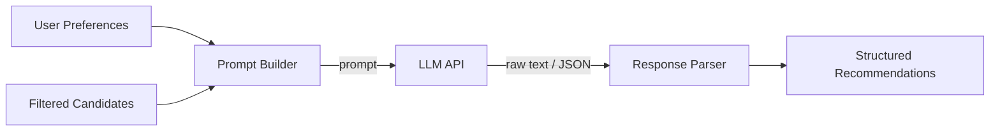
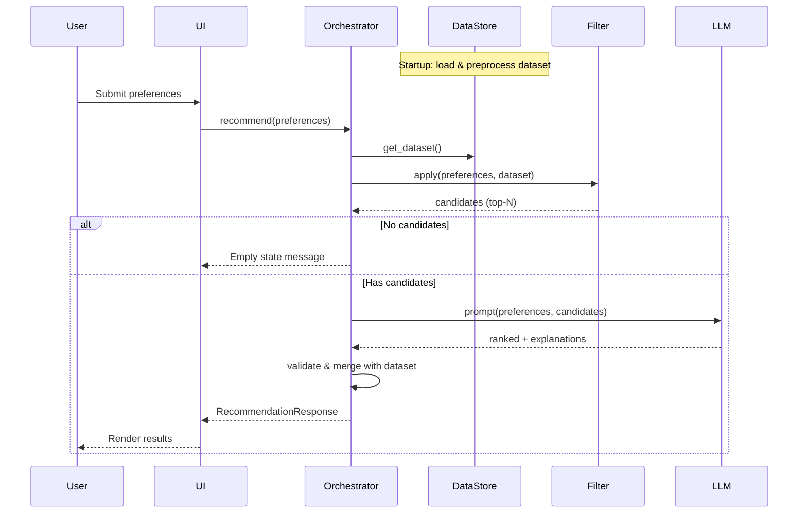
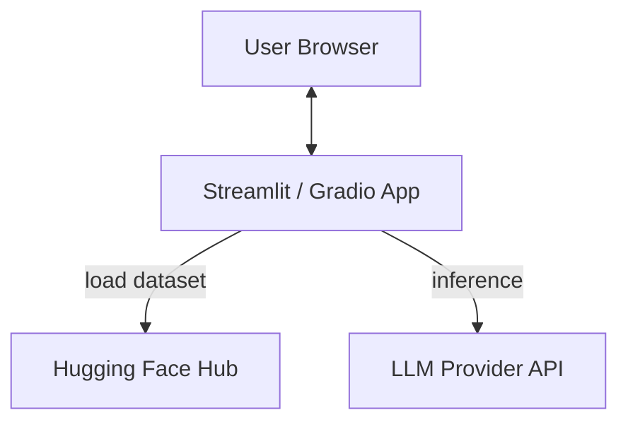
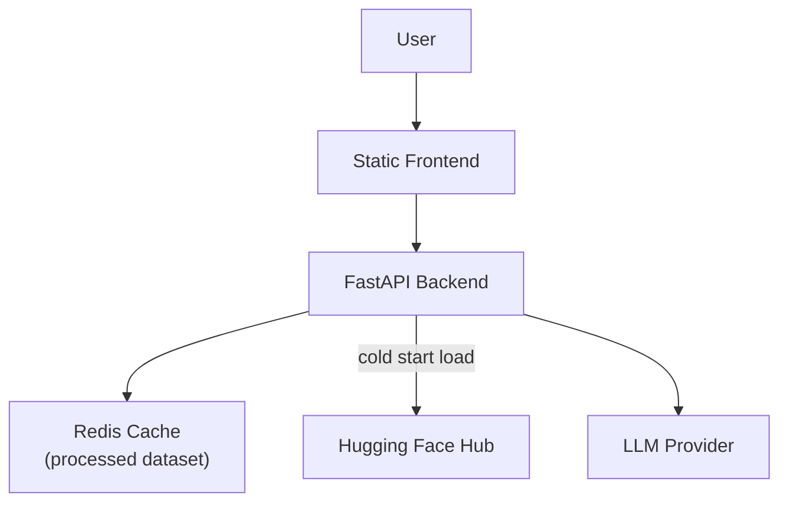

# Architecture: AI-Powered Restaurant Recommendation System

This document describes the system architecture for an AI-powered restaurant recommendation service inspired by Zomato. It expands on the project context defined in [context.md](./context.md) and serves as the primary reference for design, implementation, and review.

---

## Table of Contents

1. [Overview](#1-overview)
2. [Goals and Requirements](#2-goals-and-requirements)
3. [High-Level Architecture](#3-high-level-architecture)
4. [Component Design](#4-component-design)
5. [Data Architecture](#5-data-architecture)
6. [User Input Layer](#6-user-input-layer)
7. [Integration and Filtering Layer](#7-integration-and-filtering-layer)
8. [Recommendation Engine (LLM)](#8-recommendation-engine-llm)
9. [Output and Presentation Layer](#9-output-and-presentation-layer)
10. [End-to-End Data Flow](#10-end-to-end-data-flow)
11. [Prompt Design Strategy](#11-prompt-design-strategy)
12. [Technology Stack](#12-technology-stack)
13. [Deployment Architecture](#13-deployment-architecture)
14. [Cross-Cutting Concerns](#14-cross-cutting-concerns)
15. [Success Criteria Mapping](#15-success-criteria-mapping)
16. [Future Extensions](#16-future-extensions)

---

## 1. Overview

The system combines **structured restaurant data** from a real-world Zomato dataset with a **Large Language Model (LLM)** to deliver personalized, human-like restaurant recommendations. The core design principle is a **hybrid approach**:

1. **Deterministic filtering** narrows the candidate set using user preferences (location, budget, cuisine, rating, etc.).
2. **LLM reasoning** ranks the filtered candidates and generates natural-language explanations tailored to the user.

This separation keeps LLM context windows manageable, reduces hallucination risk, and ensures recommendations are grounded in actual dataset records.

### Problem Domain

| Aspect | Description |
|--------|-------------|
| **Domain** | Restaurant discovery and recommendation |
| **Primary users** | End users seeking dining options based on preferences |
| **Data source** | [ManikaSaini/zomato-restaurant-recommendation](https://huggingface.co/datasets/ManikaSaini/zomato-restaurant-recommendation) on Hugging Face |
| **Intelligence layer** | LLM for ranking, explanation, and optional summarization |

---

## 2. Goals and Requirements

### Functional Requirements

| ID | Requirement |
|----|-------------|
| FR-1 | Accept user preferences: location, budget, cuisine, minimum rating, and additional free-text preferences |
| FR-2 | Load and preprocess the Zomato dataset from Hugging Face |
| FR-3 | Filter restaurants deterministically before LLM invocation |
| FR-4 | Use an LLM to rank filtered candidates and explain each recommendation |
| FR-5 | Display top recommendations with name, cuisine, rating, cost, and AI explanation |
| FR-6 | Optionally provide a summary of the overall recommendation set |

### Non-Functional Requirements

| ID | Requirement |
|----|-------------|
| NFR-1 | **Accuracy** — Recommendations must reference restaurants present in the filtered candidate set |
| NFR-2 | **Latency** — End-to-end response within acceptable bounds for interactive use (target: &lt; 10s) |
| NFR-3 | **Usability** — Output must be readable and actionable, not raw model text |
| NFR-4 | **Maintainability** — Clear separation between data, filtering, LLM, and presentation layers |
| NFR-5 | **Cost efficiency** — Send only filtered subsets to the LLM, not the full dataset |

### Constraints

- Dataset fields and schema are defined by the Hugging Face source; preprocessing must adapt to actual column names at load time.
- LLM output must be constrained to structured formats where possible to simplify parsing and display.
- Filtering logic must run locally; the LLM must not be responsible for initial dataset-wide search.

---

## 3. High-Level Architecture



### Architectural Pattern

The system follows a **pipeline architecture** with five logical stages:

```
User Preferences
      ↓
Data Ingestion (Hugging Face Zomato dataset)
      ↓
Filter & Prepare (structured data matching user input)
      ↓
LLM Prompt (rank, explain, summarize)
      ↓
Formatted Recommendations (name, cuisine, rating, cost, explanation)
```

Each stage has a single responsibility and well-defined inputs/outputs, enabling independent development and testing.

---

## 4. Component Design

### 4.1 Client Layer

**Responsibility:** Collect user preferences and render recommendation results.

| Component | Role |
|-----------|------|
| **Preference Form** | Captures location, budget, cuisine, minimum rating, and optional free-text preferences |
| **Results View** | Displays ranked restaurants with structured fields and AI explanations |
| **Loading / Error States** | Communicates progress during dataset load, filtering, and LLM calls |

**Interface options (implementation choice):**

- **Web UI** — Streamlit, Gradio, or React frontend (recommended for demo and usability)
- **CLI** — Lightweight option for development and automated testing

### 4.2 Application Layer (Orchestrator)

**Responsibility:** Coordinate the end-to-end recommendation pipeline.

| Component | Role |
|-----------|------|
| **API / Orchestrator** | Single entry point that sequences: validate → filter → prompt → parse → format |
| **Input Validator** | Validates and normalizes user input (e.g., budget enum, rating range 0–5) |
| **Session / State** | Optionally caches loaded dataset across requests to avoid repeated Hugging Face downloads |

**Orchestration pseudocode:**

```
function recommend(preferences):
    validated = validate(preferences)
    candidates = filter_engine.apply(dataset, validated)
    if candidates.is_empty():
        return no_results_response()
    prompt = prompt_builder.build(validated, candidates)
    raw_response = llm.generate(prompt)
    parsed = response_parser.parse(raw_response, candidates)
    return formatter.format(parsed)
```

### 4.3 Data Layer

**Responsibility:** Load, clean, normalize, and serve restaurant records.

| Component | Role |
|-----------|------|
| **Dataset Loader** | Fetches dataset via Hugging Face `datasets` library |
| **Preprocessor** | Extracts relevant fields, handles missing values, normalizes text |
| **Normalizer** | Standardizes location names, cuisine tags, cost buckets, and ratings |
| **Store** | Holds processed records in memory (DataFrame or list of domain objects) |

### 4.4 Integration Layer (Filter & Prepare)

**Responsibility:** Reduce the dataset to a relevant candidate set before LLM invocation.

| Component | Role |
|-----------|------|
| **Filter Engine** | Applies deterministic filters based on user preferences |
| **Candidate Builder** | Selects top-N candidates (by rating, relevance) and serializes them for the prompt |
| **Fallback Logic** | Relaxes filters progressively if zero candidates match (optional) |

### 4.5 Recommendation Engine (LLM)

**Responsibility:** Rank candidates and generate human-like explanations.

| Component | Role |
|-----------|------|
| **Prompt Builder** | Constructs system and user prompts with preferences and candidate JSON |
| **LLM Provider** | Calls Groq, OpenAI, Anthropic, or local model via unified client |
| **Response Parser** | Parses structured LLM output; validates restaurant names against candidate set |

### 4.6 Presentation Layer

**Responsibility:** Transform parsed LLM output into user-friendly display.

| Component | Role |
|-----------|------|
| **Result Formatter** | Maps parsed data to display DTOs |
| **UI Renderer** | Renders cards, lists, or tables with consistent styling |

---

## 5. Data Architecture

### 5.1 Data Source

| Item | Detail |
|------|--------|
| **Dataset** | Zomato Restaurant Recommendation |
| **Source** | [Hugging Face — ManikaSaini/zomato-restaurant-recommendation](https://huggingface.co/datasets/ManikaSaini/zomato-restaurant-recommendation) |
| **Load method** | `datasets.load_dataset("ManikaSaini/zomato-restaurant-recommendation")` |

### 5.2 Expected Data Fields

Based on project context, the following fields are primary targets for extraction and use:

| Field | Usage |
|-------|-------|
| **Restaurant name** | Identity, display, LLM grounding |
| **Location** | Hard filter by user-selected city/area |
| **Cuisine** | Filter and display |
| **Cost** | Budget mapping (low / medium / high) |
| **Rating** | Minimum rating filter and ranking signal |
| **Additional metadata** | Context for LLM explanations (e.g., address, votes, dish types) |

> **Note:** Actual column names in the dataset may differ. The preprocessor must map source columns to internal canonical names at load time.

### 5.3 Internal Domain Model

```python
Restaurant:
    id: str                    # Stable identifier (generated or from dataset)
    name: str
    location: str              # Normalized city/area
    cuisines: list[str]        # Parsed from comma-separated or multi-value field
    cost_for_two: int | None   # Numeric cost if available
    cost_bucket: enum          # LOW | MEDIUM | HIGH (derived)
    rating: float              # 0.0 – 5.0
    metadata: dict             # Additional fields for LLM context
```

```python
UserPreferences:
    location: str
    budget: enum               # LOW | MEDIUM | HIGH
    cuisine: str | list[str]
    min_rating: float
    additional_preferences: str | None   # Free-text: "family-friendly", "quick service"
```

```python
Recommendation:
    restaurant: Restaurant
    rank: int
    explanation: str           # AI-generated
    match_score: float | None  # Optional LLM or heuristic score
```

### 5.4 Preprocessing Pipeline



**Normalization rules:**

| Field | Normalization |
|-------|---------------|
| **Location** | Lowercase, trim whitespace, map aliases (e.g., "Bengaluru" → "Bangalore") |
| **Cuisine** | Split multi-value strings, lowercase, deduplicate |
| **Cost** | Map numeric ranges or cost labels to `LOW` / `MEDIUM` / `HIGH` buckets |
| **Rating** | Coerce to float; drop or flag invalid values |
| **Name** | Trim; preserve original for display |

### 5.5 Caching Strategy

| Cache | Scope | Invalidation |
|-------|-------|--------------|
| **Processed dataset** | Application lifetime or TTL (e.g., 24h) | Manual refresh or app restart |
| **Filter results** | Per request (optional, short-lived) | Not cached by default |
| **LLM responses** | Optional, keyed by preference hash | TTL-based if enabled |

---

## 6. User Input Layer

### 6.1 Collected Preferences

| Preference | Type | Examples | Validation |
|------------|------|----------|------------|
| **Location** | Required string | Delhi, Bangalore | Must match or fuzzy-match known locations in dataset |
| **Budget** | Enum | Low, medium, high | One of predefined buckets |
| **Cuisine** | String or multi-select | Italian, Chinese | Non-empty; partial match supported |
| **Minimum rating** | Float | 3.5, 4.0 | Range 0.0 – 5.0 |
| **Additional preferences** | Optional free-text | Family-friendly, quick service | Passed to LLM for soft matching |

### 6.2 Input Flow



### 6.3 UX Considerations

- Provide sensible defaults (e.g., minimum rating 3.0, budget medium).
- Show available locations and cuisines derived from the dataset to reduce invalid input.
- Display a clear message when filters return zero candidates, with suggestions to broaden criteria.
- **Centered Layout:** The preference inputs (filters section) are placed in the center/middle of the main page (rather than in a sidebar), with the recommendations displayed directly below them in a single-column flow.

---

## 7. Integration and Filtering Layer

### 7.1 Design Rationale

The integration layer is the **bridge between structured data and the LLM**. It ensures:

- The LLM receives only relevant, bounded context (typically 10–30 restaurants).
- Recommendations are grounded in real records, not invented establishments.
- Filtering is fast, deterministic, and testable without LLM calls.

### 7.2 Filter Pipeline

Filters are applied in sequence. Each stage narrows the candidate set:

```
Full Dataset
    → Location filter
    → Cuisine filter (partial / contains match)
    → Minimum rating filter
    → Budget / cost bucket filter
    → (Optional) Keyword pre-filter for additional preferences
    → Top-N selection by rating
    → Candidate list for LLM
```

### 7.3 Filter Specifications

| Filter | Logic | Match type |
|--------|-------|------------|
| **Location** | `restaurant.location == preferences.location` (normalized) | Exact or fuzzy |
| **Cuisine** | Any cuisine in list contains user cuisine | Partial, case-insensitive |
| **Min rating** | `restaurant.rating >= preferences.min_rating` | Numeric threshold |
| **Budget** | `restaurant.cost_bucket == preferences.budget` | Exact enum match |

### 7.4 Candidate Builder

After filtering, the candidate builder:

1. Sorts remaining restaurants by rating (descending) as a default pre-rank.
2. Caps the list at **N candidates** (recommended: 15–25) to fit LLM context limits.
3. Serializes each candidate to a compact JSON structure for the prompt.

**Example candidate payload:**

```json
[
  {
    "id": "r_1042",
    "name": "Example Bistro",
    "cuisines": ["Italian", "Continental"],
    "rating": 4.2,
    "cost_bucket": "MEDIUM",
    "cost_for_two": 800
  }
]
```

### 7.5 Zero-Result Handling

If no restaurants match all filters, the system should:

1. Attempt progressive relaxation (e.g., drop cuisine filter, then lower min rating).
2. If still empty, return a user-facing message with actionable suggestions.
3. Never call the LLM with an empty candidate set.

---

## 8. Recommendation Engine (LLM)

### 8.1 Responsibilities

The LLM performs tasks that benefit from natural language understanding:

| Task | Description |
|------|-------------|
| **Rank** | Order candidates by overall fit to user preferences |
| **Explain** | Generate a concise reason why each restaurant matches |
| **Summarize** | Optionally provide an overview of the recommendation set |

The LLM does **not** search the full dataset or invent restaurants outside the candidate list.

### 8.2 LLM Integration Architecture



### 8.3 Grounding and Hallucination Mitigation

| Strategy | Implementation |
|----------|----------------|
| **Closed candidate set** | Prompt explicitly lists only provided restaurants |
| **Structured output** | Request JSON with restaurant `id` or `name` from candidate list |
| **Post-validation** | Parser rejects recommendations not in candidate set |
| **Temperature** | Use low temperature (0.2–0.5) for consistent ranking |
| **Retry on parse failure** | Re-prompt with format correction if JSON is invalid |

### 8.4 Expected LLM Output Schema

```json
{
  "summary": "Three strong Italian options in Bangalore within your budget, all rated above 4.0.",
  "recommendations": [
    {
      "restaurant_id": "r_1042",
      "rank": 1,
      "explanation": "Highly rated Italian spot with moderate pricing, ideal for a relaxed dinner."
    },
    {
      "restaurant_id": "r_2087",
      "rank": 2,
      "explanation": "Popular among families; consistent ratings and approachable menu."
    }
  ]
}
```

---

## 9. Output and Presentation Layer

### 9.1 Display Requirements

Each recommendation card or row must include:

| Field | Source |
|-------|--------|
| **Restaurant name** | Dataset (via parsed LLM `restaurant_id`) |
| **Cuisine** | Dataset |
| **Rating** | Dataset |
| **Estimated cost** | Dataset (`cost_for_two` or cost bucket label) |
| **AI explanation** | LLM output |

Optional: overall summary paragraph from LLM.

### 9.2 Presentation Layout

```
┌─────────────────────────────────────────────────────────┐
│  Recommendations for: Bangalore · Italian · Medium      │
│  Minimum rating: 4.0                                    │
├─────────────────────────────────────────────────────────┤
│  Summary: Three strong Italian options in Bangalore...  │
├─────────────────────────────────────────────────────────┤
│  #1  Example Bistro                          ★ 4.5     │
│      Italian, Continental · ₹800 for two                │
│      "Highly rated Italian spot with moderate pricing..." │
├─────────────────────────────────────────────────────────┤
│  #2  ...                                                │
└─────────────────────────────────────────────────────────┘
```

### 9.3 Formatting Rules

- Rank restaurants in LLM-specified order (fallback: rating descending).
- Truncate long explanations with "Read more" if needed.
- Use consistent currency and rating formatting.
- Never display raw LLM JSON to the user.

---

## 10. End-to-End Data Flow

### 10.1 Sequence Diagram



### 10.2 Request Lifecycle

| Phase | Duration (typical) | Blocking |
|-------|-------------------|----------|
| Input validation | &lt; 10 ms | Yes |
| Filter application | 10–100 ms | Yes |
| LLM inference | 2–8 s | Yes |
| Parse & format | &lt; 50 ms | Yes |
| **Total** | **~2–10 s** | — |

---

## 11. Prompt Design Strategy

Prompt design is **critical to recommendation quality**. The prompt must give the LLM enough context to reason while constraining output format.

### 11.1 Prompt Structure

```
[System]
You are a restaurant recommendation assistant. You rank and explain
restaurants ONLY from the provided candidate list. Do not invent
restaurants. Output valid JSON matching the specified schema.

[User]
User preferences:
- Location: {location}
- Budget: {budget}
- Cuisine: {cuisine}
- Minimum rating: {min_rating}
- Additional preferences: {additional_preferences}

Candidates (JSON):
{candidates_json}

Tasks:
1. Rank the top 5 restaurants by fit to preferences.
2. Explain why each matches (1-2 sentences each).
3. Provide a brief overall summary.

Output JSON schema:
{schema}
```

### 11.2 Prompt Design Principles

| Principle | Rationale |
|-----------|-----------|
| **Explicit candidate list** | Grounds the model in real data |
| **Structured output schema** | Enables reliable parsing |
| **Preference restatement** | Keeps user context salient during ranking |
| **Soft preference handling** | Free-text preferences (e.g., "family-friendly") interpreted by LLM, not hard filters |
| **Rank cap** | Limit to top 5 for focused, readable output |

---

## 12. Technology Stack

Recommended stack aligned with the hybrid filtering + LLM architecture:

| Layer | Recommended Technology | Alternatives |
|-------|------------------------|--------------|
| **Language** | Python 3.10+ | — |
| **Dataset loading** | `datasets` (Hugging Face) | Pandas + manual download |
| **Data processing** | Pandas | Polars |
| **LLM client** | Groq API (via OpenAI compatible client or Groq SDK) / OpenAI API | Anthropic API, Ollama (local), LiteLLM (multi-provider) |
| **Web UI** | Streamlit or Gradio | FastAPI + React |
| **API (optional)** | FastAPI | Flask |
| **Config / secrets** | `python-dotenv`, environment variables | — |
| **Testing** | pytest | unittest |

### 12.1 Suggested Project Structure

```
Milestone_Zomato/
├── src/
│   ├── data/
│   │   ├── loader.py          # Hugging Face dataset loading
│   │   ├── preprocessor.py    # Normalization pipeline
│   │   └── models.py            # Restaurant, UserPreferences dataclasses
│   ├── filters/
│   │   └── filter_engine.py   # Deterministic filtering logic
│   ├── llm/
│   │   ├── prompt_builder.py  # Prompt templates
│   │   ├── client.py          # LLM API wrapper
│   │   └── parser.py          # Response parsing & validation
│   ├── presentation/
│   │   └── formatter.py       # Display DTO formatting
│   ├── orchestrator.py        # Pipeline coordination
│   └── app.py                 # Streamlit / Gradio / CLI entry point
├── tests/
├── .env.example
├── requirements.txt
├── context.md
└── architecture.md
```

---

## 13. Deployment Architecture

### 13.1 Local / Demo Deployment



Suitable for development, demos, and milestone submission.

### 13.2 Production-Oriented Deployment (Future)



| Component | Role |
|-----------|------|
| **Frontend** | Hosted static UI or SSR app |
| **Backend API** | Stateless recommendation service |
| **Cache** | Avoid repeated dataset preprocessing |
| **Secrets manager** | Secure LLM API keys |

---

## 14. Cross-Cutting Concerns

### 14.1 Error Handling

| Error | Handling |
|-------|----------|
| Dataset load failure | Retry with backoff; show user-friendly error |
| Empty filter results | Relax filters or suggest broader criteria |
| LLM timeout / API error | Retry once; fallback to rating-sorted list without explanations |
| Invalid LLM JSON | Re-prompt with format hint; fallback to heuristic ranking |
| Unknown restaurant in LLM output | Discard entry; log for monitoring |

### 14.2 Logging and Observability

- Log filter counts (input size → candidate size).
- Log LLM latency and token usage.
- Log parse failures and hallucination rejections.
- Avoid logging full user PII or API keys.

### 14.3 Security

| Concern | Mitigation |
|---------|------------|
| **API keys** | Store in environment variables, never in source control |
| **User input** | Sanitize free-text before inclusion in prompts |
| **Prompt injection** | Treat additional preferences as untrusted; use structured prompt templates |
| **Rate limiting** | Apply at API layer in production deployments |

### 14.4 Testing Strategy

| Test type | Focus |
|-----------|-------|
| **Unit** | Preprocessor normalization, individual filters, response parser |
| **Integration** | Loader → filter → candidate builder pipeline |
| **LLM (mocked)** | Prompt builder output; parser with fixture responses |
| **E2E** | Full flow with mocked LLM returning fixed JSON |

---

## 15. Success Criteria Mapping

Project success criteria from [context.md](./context.md), mapped to architectural components:

| Success Criterion | Architectural Component | Verification |
|-------------------|---------------------------|--------------|
| Dataset loads and preprocesses correctly | Data Layer (Loader, Preprocessor) | Integration test against Hugging Face dataset |
| User can specify all preference types | User Input Layer (Validator, UI) | Form/CLI acceptance test |
| System filters before LLM | Integration Layer (Filter Engine) | Assert candidate count &lt; dataset size |
| LLM returns ranked recommendations with explanations | Recommendation Engine (Prompt, Parser) | Mock LLM + output schema validation |
| Results displayed cleanly | Presentation Layer (Formatter, Renderer) | UI snapshot or manual review |

---

## 16. Future Extensions

| Extension | Description |
|-----------|-------------|
| **Semantic search** | Embed restaurants and user preferences for softer matching before LLM |
| **User history** | Personalize based on past selections and feedback |
| **Multi-turn chat** | Refine recommendations through conversational follow-ups |
| **Geospatial filtering** | Distance-based ranking using coordinates |
| **A/B prompt testing** | Compare prompt variants for explanation quality |
| **Feedback loop** | Collect thumbs up/down to improve ranking heuristics |
| **Vector database** | Scale candidate retrieval for larger datasets |

---

## Appendix: Key Design Decisions

| Decision | Choice | Alternatives considered |
|----------|--------|-------------------------|
| Filter before LLM | Yes — hybrid approach | Full LLM retrieval over entire dataset |
| Candidate cap | Top 15–25 by rating | Send all filtered results (context limit risk) |
| Output format | Structured JSON from LLM | Free-form text only |
| UI framework | Streamlit (demo-friendly) | Custom React SPA |
| Dataset storage | In-memory after preprocess | Database (overkill for milestone scope) |

---

*This architecture document is derived from [context.md](./context.md) and should be updated as implementation reveals actual dataset schema, chosen LLM provider, and UI framework.*
