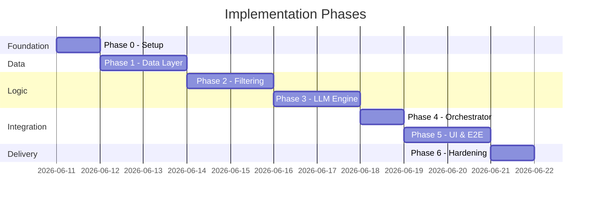
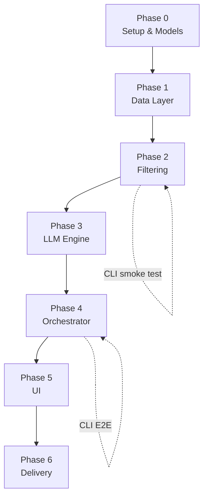

# Phase-Wise Implementation Plan

This document defines a phased rollout for the AI-powered restaurant recommendation system. It is derived from [context.md](./context.md) and [architecture.md](./architecture.md) and should be used as the primary execution guide during development.

---

## Table of Contents

1. [Overview](#1-overview)
2. [Phase Summary](#2-phase-summary)
3. [Phase 0 — Project Setup & Foundation](#phase-0--project-setup--foundation)
4. [Phase 1 — Data Ingestion & Preprocessing](#phase-1--data-ingestion--preprocessing)
5. [Phase 2 — Filtering & Candidate Preparation](#phase-2--filtering--candidate-preparation)
6. [Phase 3 — LLM Recommendation Engine](#phase-3--llm-recommendation-engine)
7. [Phase 4 — Orchestration & Presentation Logic](#phase-4--orchestration--presentation-logic)
8. [Phase 5 — User Interface & End-to-End Integration](#phase-5--user-interface--end-to-end-integration)
9. [Phase 6 — Hardening, Testing & Delivery](#phase-6--hardening-testing--delivery)
10. [Dependency Graph](#dependency-graph)
11. [Success Criteria Checklist](#success-criteria-checklist)
12. [Risk Register](#risk-register)

---

## 1. Overview

### Implementation Strategy

The build follows the **pipeline architecture** defined in the architecture document:

```
User Preferences → Data Ingestion → Filter & Prepare → LLM → Formatted Output
```

Each phase delivers a **testable, independently verifiable layer** before the next phase begins. This reduces integration risk and aligns each milestone with a specific architectural component.

### Guiding Principles

| Principle | Application |
|-----------|-------------|
| **Bottom-up layering** | Data layer first, then filters, then LLM, then UI |
| **Test as you build** | Unit tests per module; integration tests at phase boundaries |
| **Ground before generate** | Filtering must work before any LLM integration |
| **Structured over free-form** | JSON LLM output and typed domain models from the start |
| **Minimal viable path** | CLI or script-based smoke tests before full UI |

### Estimated Timeline

| Phase | Focus | Estimated Duration |
|-------|--------|------------------|
| Phase 0 | Setup & foundation | 0.5 – 1 day |
| Phase 1 | Data ingestion & preprocessing | 1 – 2 days |
| Phase 2 | Filtering & candidates | 1 – 2 days |
| Phase 3 | LLM engine | 1 – 2 days |
| Phase 4 | Orchestrator & formatter | 0.5 – 1 day |
| Phase 5 | UI & E2E | 1 – 2 days |
| Phase 6 | Hardening & delivery | 0.5 – 1 day |
| **Total** | | **~5 – 10 days** |

> Durations assume a single developer working part-time to full-time. Adjust based on team size and LLM provider familiarity.

---

## 2. Phase Summary



| Phase | Architectural Layer | Primary Deliverable | Blocks |
|-------|----------------------|---------------------|--------|
| 0 | Foundation | Project scaffold, domain models, config, basic web UI input | All phases |
| 1 | Data Layer | Loaded, normalized, cached dataset | 2, 3, 4, 5 |
| 2 | Integration Layer | Filter engine + candidate builder | 3, 4, 5 |
| 3 | Recommendation Engine | Prompt, LLM client, parser | 4, 5 |
| 4 | App + Presentation | Orchestrator + formatter | 5 |
| 5 | Client Layer | Streamlit/Gradio UI, full pipeline | 6 |
| 6 | Cross-cutting | Tests, docs, demo readiness | — |

---

## Phase 0 — Project Setup & Foundation

**Goal:** Establish project structure, dependencies, configuration, and shared domain models so all subsequent phases share a consistent foundation.

**Maps to:** Architecture §12 (Technology Stack), §12.1 (Project Structure), §5.3 (Domain Model)

### Tasks

| # | Task | Details |
|---|------|---------|
| 0.1 | Initialize repository structure | Create `src/`, `tests/`, and module folders per architecture |
| 0.2 | Define `requirements.txt` | `datasets`, `pandas`, `python-dotenv`, LLM client (Groq/OpenAI compatible), `streamlit` or `gradio`, `pytest` |
| 0.3 | Add `.env.example` | Template for `GROQ_API_KEY` (and option for `OPENAI_API_KEY`), optional model name |
| 0.4 | Implement domain models | `Restaurant`, `UserPreferences`, `Recommendation`, enums for `Budget` and `CostBucket` in `src/data/models.py` |
| 0.5 | Add config module | Load env vars, define constants (candidate cap N=20, top-K recommendations=5) |
| 0.6 | Set up pytest | Basic `tests/conftest.py` with shared fixtures scaffold |
| 0.7 | Add basic web UI scaffold | Minimal Streamlit/Gradio app (`src/app.py`) as the input source — preference form stub (location, budget, cuisine, min rating, free-text) wired to call the orchestrator in later phases |

### Target File Structure (after Phase 0)

```
Milestone_Zomato/
├── src/
│   ├── data/
│   │   └── models.py
│   ├── config.py
│   ├── app.py
│   └── __init__.py
├── tests/
│   └── conftest.py
├── Docs/
├── .env.example
├── requirements.txt
└── README.md
```

### Deliverables

- [ ] Runnable Python environment with all dependencies installed
- [ ] Domain model dataclasses with type hints and enums
- [ ] Config loads secrets from environment without hardcoding keys
- [ ] `pytest` runs successfully (even if no business tests yet)
- [ ] Basic web UI scaffold launches and displays the preference input form

### Exit Criteria

- Project imports cleanly: `from src.data.models import Restaurant, UserPreferences`
- No secrets committed to git
- README includes setup instructions (venv, `pip install`, `.env` copy)
- `streamlit run src/app.py` (or equivalent) launches the basic input form

### Requirements Addressed

- FR-4 (foundation for typed preferences)
- NFR-4 (maintainable module separation)

---

## Phase 1 — Data Ingestion & Preprocessing

**Goal:** Load the Zomato dataset from Hugging Face, map columns to internal models, normalize fields, and cache the processed dataset in memory.

**Maps to:** Context §1 (Data Ingestion), Architecture §5 (Data Architecture), Success Criterion #1

### Tasks

| # | Task | Details |
|---|------|---------|
| 1.1 | Implement dataset loader | `src/data/loader.py` — `load_dataset("ManikaSaini/zomato-restaurant-recommendation")` |
| 1.2 | Inspect & map schema | Log actual column names on first load; create column mapping dict to canonical fields |
| 1.3 | Implement preprocessor | `src/data/preprocessor.py` — extract name, location, cuisine, cost, rating, metadata |
| 1.4 | Normalize location | Lowercase, trim, alias map (e.g., Bengaluru → Bangalore) |
| 1.5 | Normalize cuisine | Split comma-separated values, lowercase, deduplicate into `list[str]` |
| 1.6 | Derive cost buckets | Map numeric cost or labels to `LOW` / `MEDIUM` / `HIGH` (define thresholds, e.g., &lt;500, 500–1500, &gt;1500) |
| 1.7 | Normalize rating | Coerce to float; handle missing/invalid values (drop or default) |
| 1.8 | Assign stable IDs | Generate `id` per record if not present in dataset |
| 1.9 | Implement in-memory store | `get_restaurants()` returns `list[Restaurant]`; cache after first load |
| 1.10 | Add exploration script | Optional `scripts/explore_dataset.py` to print schema, sample rows, unique locations/cuisines |

### Unit Tests

| Test | Assertion |
|------|-----------|
| `test_loader_returns_records` | Dataset loads without error |
| `test_location_normalization` | Aliases and casing handled correctly |
| `test_cuisine_parsing` | Multi-value cuisine strings split correctly |
| `test_cost_bucket_derivation` | Numeric costs map to expected buckets |
| `test_rating_coercion` | Invalid ratings handled per policy |
| `test_no_empty_names` | Records with missing names are dropped or flagged |

### Deliverables

- [ ] `loader.py` and `preprocessor.py` implemented
- [ ] Processed `list[Restaurant]` available via store/cache
- [ ] Documented column mapping (inline comments or short note in README)
- [ ] List of available locations and cuisines extractable for UI dropdowns (Phase 5)

### Exit Criteria

- Integration test loads real Hugging Face dataset and returns &gt; 0 valid restaurants
- Normalization rules from Architecture §5.4 are applied consistently
- Dataset cached after first load (no re-download on every call within same session)

### Requirements Addressed

- FR-2
- Success Criterion: *Dataset loads and preprocesses correctly from Hugging Face*

---

## Phase 2 — Filtering & Candidate Preparation

**Goal:** Build the integration layer that deterministically filters restaurants by user preferences and produces a bounded candidate list for the LLM.

**Maps to:** Context §3 (Integration Layer), Architecture §7 (Integration and Filtering Layer), Success Criterion #3

### Tasks

| # | Task | Details |
|---|------|---------|
| 2.1 | Implement input validator | `src/validators.py` — validate location, budget enum, cuisine, min_rating (0–5), optional free-text |
| 2.2 | Implement location filter | Exact or normalized match against `restaurant.location` |
| 2.3 | Implement cuisine filter | Partial, case-insensitive match against any item in `restaurant.cuisines` |
| 2.4 | Implement min rating filter | `restaurant.rating >= preferences.min_rating` |
| 2.5 | Implement budget filter | `restaurant.cost_bucket == preferences.budget` |
| 2.6 | Build filter engine | `src/filters/filter_engine.py` — chain filters in sequence |
| 2.7 | Implement candidate builder | Sort by rating desc; cap at N (15–25); serialize to compact JSON |
| 2.8 | Zero-result fallback | Progressive relaxation: drop cuisine → lower min rating → drop budget |
| 2.9 | Add filter logging | Log dataset size → post-filter size → candidate count |
| 2.10 | CLI smoke test | Script accepting preferences, printing candidate JSON (no LLM yet) |

### Unit Tests

| Test | Assertion |
|------|-----------|
| `test_location_filter` | Only matching city returned |
| `test_cuisine_partial_match` | "Italian" matches "Italian, Continental" |
| `test_min_rating_filter` | Restaurants below threshold excluded |
| `test_budget_filter` | Only matching cost bucket returned |
| `test_candidate_cap` | Output never exceeds N |
| `test_zero_result_relaxation` | Fallback returns candidates when strict filter is empty |
| `test_validator_rejects_invalid_rating` | Rating &gt; 5 or &lt; 0 rejected |

### Deliverables

- [ ] `filter_engine.py` with chained filters
- [ ] `CandidateBuilder` producing JSON-ready candidate list
- [ ] Input validator returning `UserPreferences` or validation errors
- [ ] CLI/script demonstrating filter output for sample preferences

### Exit Criteria

- Filter pipeline runs in &lt; 100 ms on full in-memory dataset
- Candidate count always ≤ N and &lt; full dataset size for typical queries
- Empty strict-match cases handled with relaxation or clear empty response
- **No LLM calls in this phase**

### Requirements Addressed

- FR-1 (validation portion)
- FR-3
- NFR-5 (cost efficiency — bounded candidate set)
- Success Criterion: *System filters restaurants before sending context to the LLM*

---

## Phase 3 — LLM Recommendation Engine

**Goal:** Integrate the LLM to rank filtered candidates, generate explanations, and optionally summarize — with structured output and hallucination safeguards.

**Maps to:** Context §4 (Recommendation Engine), Architecture §8 (Recommendation Engine), §11 (Prompt Design), Success Criterion #4

### Tasks

| # | Task | Details |
|---|------|---------|
| 3.1 | Implement prompt builder | `src/llm/prompt_builder.py` — system + user prompt with preferences, candidates, JSON schema |
| 3.2 | Define output JSON schema | `summary` + `recommendations[]` with `restaurant_id`, `rank`, `explanation` |
| 3.3 | Implement LLM client | `src/llm/client.py` — wrapper around Groq (via OpenAI-compatible endpoint) or OpenAI; low temperature (0.2–0.5) |
| 3.4 | Implement response parser | `src/llm/parser.py` — parse JSON, validate IDs against candidate set |
| 3.5 | Hallucination rejection | Discard recommendations whose `restaurant_id` is not in candidates |
| 3.6 | Retry on parse failure | Re-prompt once with format correction hint |
| 3.7 | Fallback ranking | If LLM fails, return rating-sorted top 5 without AI explanations |
| 3.8 | Prompt iteration | Test 3–5 preference scenarios; refine prompt for explanation quality |
| 3.9 | Mock LLM for tests | Fixture-based mock returning valid/invalid JSON |

### Unit Tests

| Test | Assertion |
|------|-----------|
| `test_prompt_includes_all_preferences` | Location, budget, cuisine, rating, additional text present |
| `test_prompt_includes_candidate_list` | All candidate IDs appear in prompt |
| `test_parser_valid_json` | Correctly parses well-formed response |
| `test_parser_rejects_unknown_id` | Hallucinated restaurant IDs discarded |
| `test_parser_handles_malformed_json` | Triggers retry or fallback |
| `test_fallback_ranking` | Returns rating-sorted list when LLM unavailable |

### Deliverables

- [ ] `prompt_builder.py`, `client.py`, `parser.py`
- [ ] Documented prompt template (in code or Docs)
- [ ] Mock-based test suite (no live API calls in CI)
- [ ] Manual test script calling live LLM with sample candidates

### Exit Criteria

- Live LLM call returns parseable JSON for at least 3 diverse preference sets
- All displayed recommendations reference IDs from the candidate set (NFR-1)
- LLM latency logged; end-to-end filter + LLM target &lt; 10s (NFR-2)
- Free-text additional preferences influence ranking/explanations (soft match)

### Requirements Addressed

- FR-4
- FR-6 (summary field)
- NFR-1, NFR-2
- Success Criterion: *LLM returns ranked recommendations with clear explanations*

---

## Phase 4 — Orchestration & Presentation Logic

**Goal:** Wire all layers into a single `recommend()` pipeline and format results for display — without UI yet.

**Maps to:** Architecture §4.2 (Orchestrator), §9 (Presentation Layer), §10 (End-to-End Data Flow)

### Tasks

| # | Task | Details |
|---|------|---------|
| 4.1 | Implement orchestrator | `src/orchestrator.py` — `recommend(preferences) → RecommendationResponse` |
| 4.2 | Pipeline sequencing | validate → filter → (empty check) → prompt → LLM → parse → format |
| 4.3 | Implement result formatter | `src/presentation/formatter.py` — merge LLM output with dataset fields |
| 4.4 | Build display DTOs | Each result: name, cuisine, rating, cost, explanation, rank |
| 4.5 | Empty state response | Structured message when no candidates after relaxation |
| 4.6 | Error handling | Wrap dataset, filter, LLM errors with user-safe messages |
| 4.7 | Add logging | Filter counts, LLM latency, parse failures (Architecture §14.2) |
| 4.8 | CLI end-to-end script | Accept preferences via args or stdin; print formatted recommendations |

### Unit / Integration Tests

| Test | Assertion |
|------|-----------|
| `test_orchestrator_happy_path` | Mock LLM → formatted response with all required fields |
| `test_orchestrator_empty_candidates` | Returns empty state, no LLM call |
| `test_formatter_merges_dataset_fields` | Name, cuisine, rating, cost from dataset; explanation from LLM |
| `test_orchestrator_llm_fallback` | Degrades gracefully when LLM fails |

### Deliverables

- [ ] `orchestrator.py` as single entry point
- [ ] `formatter.py` producing display-ready structures
- [ ] CLI demonstrating full pipeline (mock or live LLM)
- [ ] Structured error and empty-state responses

### Exit Criteria

- One function call runs the entire backend pipeline
- Output never exposes raw LLM JSON (NFR-3)
- All five display fields present per recommendation (Context §5)
- Clear separation: orchestrator does not contain filter or prompt logic inline

### Requirements Addressed

- FR-5 (formatter portion)
- NFR-3, NFR-4
- All workflow stages from Context §System Workflow

---

## Phase 5 — User Interface & End-to-End Integration

**Goal:** Build a user-facing interface that collects preferences, invokes the orchestrator, and renders recommendations with loading and error states.

**Maps to:** Context §2 (User Input), §5 (Output Display), Architecture §4.1 (Client Layer), §6 (User Input Layer)

### Tasks

| # | Task | Details |
|---|------|---------|
| 5.1 | Choose UI framework | Streamlit (recommended) or Gradio |
| 5.2 | Implement preference form | Place location dropdown, budget select, cuisine input, min rating slider, and optional free-text in the center/middle of the main page (not in a sidebar) |
| 5.3 | Populate dropdowns from dataset | Unique locations and top cuisines from Phase 1 store |
| 5.4 | Set sensible defaults | Min rating 3.0, budget medium |
| 5.5 | Implement submit flow | Call `orchestrator.recommend()` on button click |
| 5.6 | Loading states | Spinner during dataset load (first run) and LLM inference |
| 5.7 | Results view | Cards or table: rank, name, cuisine, rating, cost, explanation (no restaurant images to keep UI lightweight) |
| 5.8 | Summary section | Display LLM overall summary if present |
| 5.9 | Empty & error states | User-friendly messages with suggestions to broaden criteria |
| 5.10 | Cache dataset in session | Avoid re-loading Hugging Face data on every interaction |
| 5.11 | E2E test | Automated test with mocked LLM through UI or orchestrator |

### UI Wireframe (Target)

```
┌──────────────────────────────────────────────┐
│  🍽️ Zomato AI Restaurant Recommendations      │
├──────────────────────────────────────────────┤
│  Location: [Bangalore ▼]                     │
│  Budget:     [Medium ▼]                      │
│  Cuisine:    [Italian        ]               │
│  Min Rating: [====●====] 4.0                 │
│  Notes:      [family-friendly, quick service]│
│              [ Get Recommendations ]         │
├──────────────────────────────────────────────┤
│  Summary: ...                                │
│  #1 Name · ★4.5 · ₹800 · Italian             │
│     "Explanation..."                         │
└──────────────────────────────────────────────┘
```

### Deliverables

- [ ] `src/app.py` (Streamlit/Gradio entry point)
- [ ] Fully interactive demo accessible via `streamlit run src/app.py`
- [ ] Loading, error, and empty states implemented
- [ ] E2E test with mocked LLM

### Exit Criteria

- User can specify all preference types via UI (FR-1)
- UI layout is centered/single-column: filters are at the top/middle of the main container, and recommendations display directly below
- Results displayed in clean, readable format — not raw model text (NFR-3), with no redundant restaurant images
- First-load dataset caching works; subsequent requests are faster
- Manual walkthrough of 3+ scenarios succeeds end-to-end

### Requirements Addressed

- FR-1, FR-5, FR-6
- Success Criteria #2 and #5

---

## Phase 6 — Hardening, Testing & Delivery

**Goal:** Finalize quality, documentation, and demo readiness for milestone submission.

**Maps to:** Architecture §14 (Cross-Cutting Concerns), §15 (Success Criteria Mapping), §13.1 (Deployment)

### Tasks

| # | Task | Details |
|---|------|---------|
| 6.1 | Complete test suite | Unit + integration + mocked E2E; target meaningful coverage on core paths |
| 6.2 | Security review | Confirm no API keys in code; sanitize free-text in prompts |
| 6.3 | Performance check | Verify filter &lt; 100 ms; total flow &lt; 10 s |
| 6.4 | Prompt quality review | Test edge cases: obscure cuisine, very high min rating, verbose additional prefs |
| 6.5 | Update README | Setup, env vars, run instructions, architecture overview link |
| 6.6 | Demo script | 2–3 example queries documented for reviewers |
| 6.7 | Success criteria audit | Walk through checklist in Context §Success Criteria |
| 6.8 | Optional polish | Truncate long explanations, consistent ₹ formatting, rank badges |
| 6.9 | Tag release / milestone | Git tag or submission package as required |

### Test Coverage Targets

| Area | Minimum Coverage |
|------|------------------|
| Preprocessor normalization | All normalization rules |
| Filter engine | Each filter + fallback |
| Response parser | Valid, invalid, hallucinated IDs |
| Orchestrator | Happy path, empty, LLM failure |
| Validator | All preference fields |

### Deliverables

- [ ] Passing `pytest` suite
- [ ] Updated README with run instructions
- [ ] Demo scenarios documented
- [ ] All success criteria checked off
- [ ] `.env.example` complete; secrets excluded from repo

### Exit Criteria

- All five success criteria from [context.md](./context.md) verified
- Application runs on a clean machine following README only
- Known limitations documented (e.g., dataset cities, LLM provider dependency)

### Requirements Addressed

- All FR-1 through FR-6
- All NFR-1 through NFR-5
- Full success criteria checklist

---

## Dependency Graph



**Critical path:** Phase 0 → 1 → 2 → 3 → 4 → 5 → 6

**Parallelization opportunities (if team &gt; 1):**

- Phase 5 UI mockups/wireframes can start during Phase 3 (using mock data)
- Phase 6 README draft can start during Phase 5
- Unit tests for Phase N can be written alongside Phase N+1 implementation

---

## Success Criteria Checklist

Mapped from [context.md](./context.md) to implementation phases:

| # | Criterion | Phase | Verification Method |
|---|-----------|-------|---------------------|
| 1 | Dataset loads and preprocesses correctly from Hugging Face | Phase 1 | Integration test + manual schema inspection |
| 2 | User can specify location, budget, cuisine, minimum rating, and extra preferences | Phase 5 | UI form acceptance + validator unit tests |
| 3 | System filters restaurants before sending context to the LLM | Phase 2 | Assert candidate count &lt; dataset size; log filter stages |
| 4 | LLM returns ranked recommendations with clear explanations | Phase 3 | Mock + live LLM tests; parser validation |
| 5 | Results displayed in a clean, user-friendly format | Phase 5 | Manual UI review (without redundant/generic images); formatter unit tests |

---

## Risk Register

| Risk | Impact | Likelihood | Mitigation | Phase |
|------|--------|------------|------------|-------|
| Dataset schema differs from expected columns | High | Medium | Inspect on first load; flexible column mapping in preprocessor | 1 |
| Hugging Face download slow or fails | Medium | Low | Cache processed data locally; retry with backoff | 1 |
| Zero candidates for common queries | Medium | Medium | Progressive filter relaxation; UI suggestions | 2 |
| LLM hallucinates restaurant names | High | Medium | Closed candidate set in prompt; post-parse ID validation | 3 |
| LLM returns invalid JSON | Medium | Medium | Retry with format hint; fallback to rating sort | 3 |
| LLM API cost or rate limits | Medium | Low | Cap candidates at N; mock in tests; low temperature | 3 |
| End-to-end latency &gt; 10s | Medium | Medium | Cache dataset; limit candidates; async spinner in UI | 5 |
| Prompt injection via free-text prefs | Low | Low | Sanitize input; structured prompt templates | 3, 6 |

---

## Appendix: Phase-to-File Mapping

| File | Phase |
|------|-------|
| `src/data/models.py` | 0 |
| `src/config.py` | 0 |
| `src/data/loader.py` | 1 |
| `src/data/preprocessor.py` | 1 |
| `src/validators.py` | 2 |
| `src/filters/filter_engine.py` | 2 |
| `src/llm/prompt_builder.py` | 3 |
| `src/llm/client.py` | 3 |
| `src/llm/parser.py` | 3 |
| `src/orchestrator.py` | 4 |
| `src/presentation/formatter.py` | 4 |
| `src/app.py` | 0 (scaffold), 5 (complete) |
| `tests/*` | 1 – 6 |
| `README.md` | 0 (stub), 6 (complete) |

---

*This plan should be updated as implementation progresses — especially after Phase 1 reveals the actual dataset schema and Phase 3 confirms the chosen LLM provider.*
